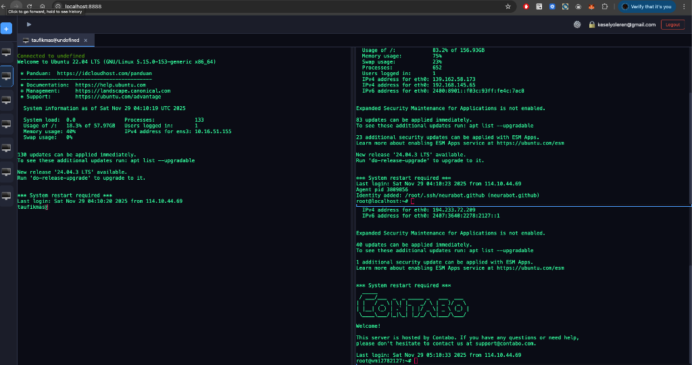

# SSH Client API

This is a FastAPI application that provides an API for managing SSH connections and users. It uses a PostgreSQL database to store user information.

## Features

*   **Web-based SSH Client**: Full-featured terminal in your browser.
*   **Split View**: Drag and drop terminal tabs to create split views (vertical/horizontal) for multitasking.
*   **User Management**: Secure user registration, login, and MFA support.
*   **Host Management**: Save and organize your SSH hosts with labels and groups.
*   **Themes**: Customizable terminal themes (Hacker Blue, Ubuntu, etc.).
*   **Dockerized**: Easy deployment with Docker Compose.

## Screenshots



## Installation and Running the Project

To run this project, you will need to have Docker and Docker Compose installed.

1.  **Clone the repository:**
    ```bash
    git clone <repository-url>
    cd ssh_cleint
    ```

2.  **Run with Docker Compose:**
    ```bash
    docker-compose up --build
    ```
    This will build the containers, start the database, backend, and frontend, and automatically apply database migrations.

3.  **Access the Application:**
    Open your browser and navigate to `http://localhost`.

## Development

*   **Frontend**: Vue.js 3 + Vite (Port 80 in Docker, 5173 for local dev)
*   **Backend**: FastAPI + SQLAlchemy (Port 8000)
*   **Database**: PostgreSQL (Port 5432)

